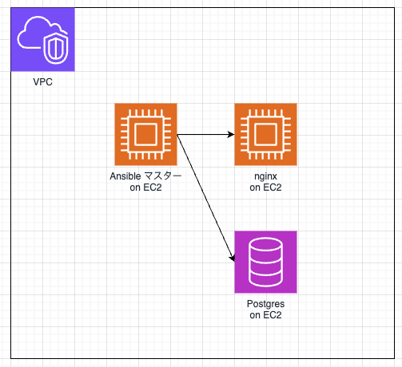

# Ansible_sample
### Ansibleサンプル
Ansibleのプレイブックのサンプルとして作成

#### プレイブックの実行方法
```bash
ansible-playbook -i inventory.txt install_nginx.yaml -v
```
mainのプレイブックは下記で、WebサーバとDBサーバのリソースごとにロールを分けて導入する構成にしている。
```yaml
- name: Setup nginx server on myserver list (host group)
  hosts:
    - devservers
  become: True
  roles:
    - webserver
    - dbserver
```

#### ディレクトリ構成
```bash
./roles
　∟webserver
　　∟tasks
　　　∟main.yaml
　∟dbserver
　　∟tasks
　　　∟main.yaml
```
#### システム構成
マスターサーバから、EC2上にNginxのインストールとEC2上にPostgresのインストールなどを実施



